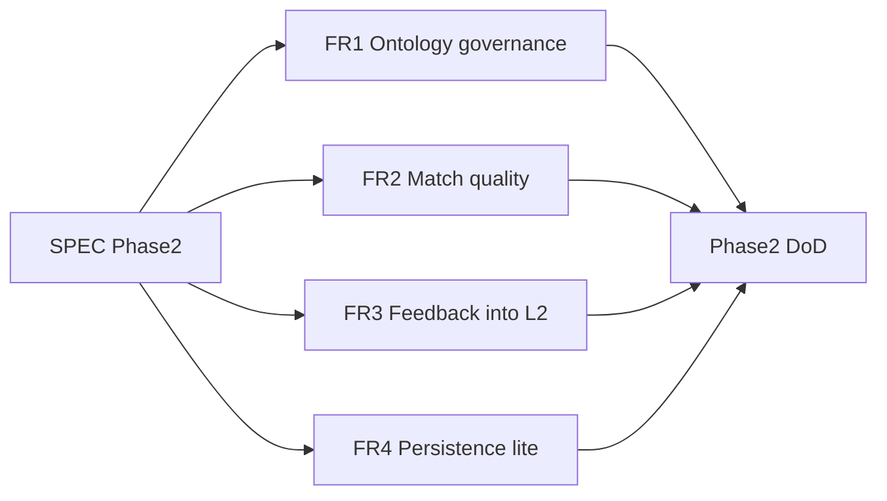

# PSERS Presales Intelligence — Product SPEC

**Status:** Active (Phase 2)  
**Version:** 0.2.0-spec  
**Last updated:** 2026-07-12  
**Authority:** This file is the source of truth for Phase-2 implementation. Feature slices live under [`specs/`](specs/).

---

## 1. Purpose and users

### Product

**PSERS Presales Intelligence** maps messy customer RFP language to a stable capability ontology, then to Motorola Solutions (MSI) product coverage.

```text
RFP phrases (L2) → Canonical capabilities (L1) → Vendor products (L3)
```

Nothing links RFP text directly to products. Everything routes through L1.

### Primary user

Presales / bid analyst preparing responses for public-safety LMR (Land Mobile Radio) procurements.

### Root model (immutable)

- **Root:** `PSERS` — Public Safety Emergency Response System (of Systems)
- **Facets:** Stack (`INFRA|SENS|PLAT|APP|SVC|XCUT`) + Mission tags  
- **Details:** [docs/psers-root.md](docs/psers-root.md)

---

## 2. As-built baseline (MVP freeze — S0–S4)

Do not re-litigate MVP scope. Agents must treat the following as current truth.

| Layer | Current state | Location |
|-------|---------------|----------|
| L1 | 192 LMR `draft` + 32 stubs = 224 | [ontology/l1_capabilities.json](ontology/l1_capabilities.json) |
| L2 | 492 synonyms + 42 holdout; `auto_accepted` | [ontology/l2_synonyms.json](ontology/l2_synonyms.json), [ontology/l2_synonyms_holdout.json](ontology/l2_synonyms_holdout.json) |
| L3 | 20 MSI products, 123 mappings, 116 caps | [ontology/l3_msi_products.json](ontology/l3_msi_products.json), [ontology/l3_product_capabilities.json](ontology/l3_product_capabilities.json) |
| Match | Deterministic seeds + L2 overlap + name | [ingest/matcher.py](ingest/matcher.py) |
| UI/API | FastAPI + static analyst UI | [app/match_api.py](app/match_api.py), [app/static/](app/static/) |
| Schema | Postgres DDL present; unused at runtime | [sql/schema.sql](sql/schema.sql) |
| RFP corpus | 3 allowlisted PDFs (gitignored binaries) | [data/rfp/README.md](data/rfp/README.md) |

### MVP scope locks (still in force unless this SPEC is amended)

- No broad RFP web crawl
- L2 corpus = ECSO Jackson + Erie trunked 2026 + Erie subscriber 2026 only
- L3 = MSI only
- CAD / NG911 / Sensors / MCX = stub IDs only

### Explicit non-goals (deferred past Phase 2)

- Multi-vendor competitive matrix (L3Harris, Tait, etc.)
- EIDO/IDX runtime bus
- Proposal narrative generation / pricing BOM
- Auth, multi-tenant SaaS, SOC2
- Deep CAD / sensor / MCX ontology trees (Phase 3+)

---

## 3. Phase 2 — Quality hardening (LMR vertical)

**Goal:** Make the existing loop trustworthy for bid-desk use before expanding verticals.



### FR-1 Ontology governance

| ID | Requirement |
|----|-------------|
| FR-1.1 | Support promoting L1 capabilities from `draft` → `published` (and `deprecated` when needed) |
| FR-1.2 | Maintain an explicit **top-50 bid-desk** capability list (below) as the SME publish priority set |
| FR-1.3 | After publish batch: bump ontology catalog version metadata and log in [docs/decision-log.md](docs/decision-log.md) |
| FR-1.4 | Stubs remain `stub`; do not silently publish stub verticals |

**Feature slice:** [specs/001-ontology-governance.md](specs/001-ontology-governance.md)

### FR-2 Match quality

| ID | Requirement |
|----|-------------|
| FR-2.1 | Harden TOC / boilerplate filtering in phrase harvest |
| FR-2.2 | Provide eval harness using holdout synonyms + mid-document RFP windows |
| FR-2.3 | **Target A:** demo fixture map rate **≥ 80%** (regression guard) |
| FR-2.4 | **Target B:** mid-doc 20-page window on Erie trunked **or** ECSO functional spec → shall-map rate **≥ 50%** |
| FR-2.5 | Prefer deterministic improvements; LLM only behind explicit `--llm` flag (default off) |

**Mid-doc window definition:** pages **21–40** inclusive of `erie-trunked-radio-system-2026-018.pdf` (primary); fallback pages **21–40** of `ecso-jackson-p25-functional-spec.pdf`.

**Feature slice:** [specs/002-match-quality.md](specs/002-match-quality.md)

### FR-3 Feedback loop

| ID | Requirement |
|----|-------------|
| FR-3.1 | UI feedback (`accept` / `correct` / `reject`) continues to append audit JSONL |
| FR-3.2 | `accept` and `correct` also upsert into a staged review file `ontology/l2_review_queue.json` |
| FR-3.3 | Provide a publish path from review queue → `l2_synonyms.json` (CLI or API) with dedupe |
| FR-3.4 | Rejected items recorded but not merged into L2 |

**Feature slice:** [specs/003-feedback-loop.md](specs/003-feedback-loop.md)

### FR-4 Persistence lite

| ID | Requirement |
|----|-------------|
| FR-4.1 | CLI to load L1/L2/L3 JSON into Postgres per [sql/schema.sql](sql/schema.sql) |
| FR-4.2 | Runtime API **defaults to JSON files** (no breaking change) |
| FR-4.3 | Import is idempotent (upsert by primary keys) |
| FR-4.4 | Document connection via `DATABASE_URL` env; never commit credentials |

**Feature slice:** [specs/004-persistence-lite.md](specs/004-persistence-lite.md)

---

## 4. Top-50 bid-desk capabilities (publish priority)

Aliases below map to full `PSERS.INFRA.*` IDs via L1 `alias` field. SME publish priority for FR-1:

1. `LMR.STD.P25_PHASE1`
2. `LMR.STD.P25_PHASE2`
3. `LMR.STD.DUAL_MODE_FDMA_TDMA`
4. `LMR.STD.TRUNKED_OPS`
5. `LMR.STD.CONVENTIONAL_OPS`
6. `LMR.STD.P25_CAP`
7. `LMR.CORE.GEO_REDUNDANT_CORE`
8. `LMR.CORE.NO_SPOF`
9. `LMR.CORE.CENTRALIZED_CORE`
10. `LMR.CORE.DISTRIBUTED_CORE`
11. `LMR.CORE.FAILSOFT`
12. `LMR.CORE.SITE_TRUNKING`
13. `LMR.CORE.TRANSPARENT_ROAMING`
14. `LMR.CORE.DYNAMIC_REGROUP`
15. `LMR.SITE.SIMULCAST_TRUNKED`
16. `LMR.SITE.BASE_REPEATER`
17. `LMR.SITE.COMPARATOR`
18. `LMR.SITE.VOTING_RECEIVER`
19. `LMR.SITE.SIMULCAST_TIMING`
20. `LMR.SITE.TTA`
21. `LMR.COV.DAQ_3_4`
22. `LMR.COV.COV_95_AREA`
23. `LMR.COV.GOS_1PCT`
24. `LMR.COV.PORTABLE_IN_BUILDING`
25. `LMR.COV.PORTABLE_ON_STREET`
26. `LMR.COV.COVERAGE_TESTING`
27. `LMR.COV.COVERAGE_GUARANTEE`
28. `LMR.VOICE.GROUP_CALL`
29. `LMR.VOICE.PRIVATE_CALL`
30. `LMR.VOICE.EMERGENCY_ALARM`
31. `LMR.VOICE.EMERGENCY_CALL`
32. `LMR.VOICE.PTT_ID`
33. `LMR.DATA.GPS_AVL`
34. `LMR.DATA.OTAP`
35. `LMR.DATA.TEXT_MESSAGING`
36. `LMR.SEC.AES256`
37. `LMR.SEC.OTAR`
38. `LMR.SEC.KMF`
39. `LMR.SEC.KVL`
40. `LMR.IOP.ISSI`
41. `LMR.IOP.CSSI`
42. `LMR.IOP.MUTUAL_AID_PATCH`
43. `LMR.DISP.CONSOLE_POSITIONS`
44. `LMR.DISP.LOGGING_RECORDER`
45. `LMR.NMS.UNIFIED_NMS`
46. `LMR.BH.MICROWAVE_BH`
47. `LMR.BH.IP_TRANSPORT`
48. `LMR.SUB.MULTIBAND_PORTABLE`
49. `LMR.SUB.PORTABLE_GENERAL`
50. `LMR.BB.LTE_PTT_BRIDGE`

---

## 5. Non-functional requirements

| ID | Requirement |
|----|-------------|
| NFR-1 | Cursor Pro–friendly: default deterministic pipelines; no on-demand LLM spend assumed |
| NFR-2 | Allowlisted RFP corpus unchanged unless SPEC amended |
| NFR-3 | No secrets in git; `data/rfp/*.pdf` and feedback runtime files stay gitignored as configured |
| NFR-4 | Validators `validate_l1.py` / `validate_l2.py` / `validate_l3.py` must remain green |
| NFR-5 | Prefer small PRs / slices aligned to `specs/00x-*.md` |

---

## 6. Phase-2 Definition of Done

- [ ] `py -3.12 ontology/validate_l1.py` → OK  
- [ ] `py -3.12 ontology/validate_l2.py` → OK  
- [ ] `py -3.12 ontology/validate_l3.py` → OK  
- [ ] ≥ **50** L1 capabilities from the top-50 list marked `published`  
- [ ] Eval harness exists and reports demo map-rate ≥ 80% and mid-doc map-rate ≥ 50% (or documents gap with issue filed in decision-log)  
- [ ] Feedback `accept`/`correct` updates staged L2 review queue; publish path merges into L2 with test  
- [ ] Postgres import CLI works against local DB when `DATABASE_URL` set  
- [ ] Each completed slice flips **Status → Done** in its `specs/00x-*.md`  
- [ ] README points here as next-work authority  

---

## 7. Cursor agent protocol

1. Read this `SPEC.md` and the single relevant [`specs/00x-*.md`](specs/) slice.  
2. Implement **only** that slice.  
3. Update the slice checklist / Status.  
4. Run validators touched by the change.  
5. Do **not** expand into Phase-3 verticals or deferred non-goals without amending this SPEC.  
6. Prefer Auto/Composer; keep on-demand spend disabled unless the user enables it.

**Recommended order:** `001` → `002` → `003` → `004`.

---

## 8. Appendix — Phase 3+ (out of scope now)

- Deep CAD / NG911 / Sensors / MCX capability trees  
- Multi-vendor L3  
- Broader RFP corpus / crawl  
- Proposal generation, pricing, SSO  

When ready, amend this SPEC with a Phase-3 section and new `specs/01x-*.md` slices.
