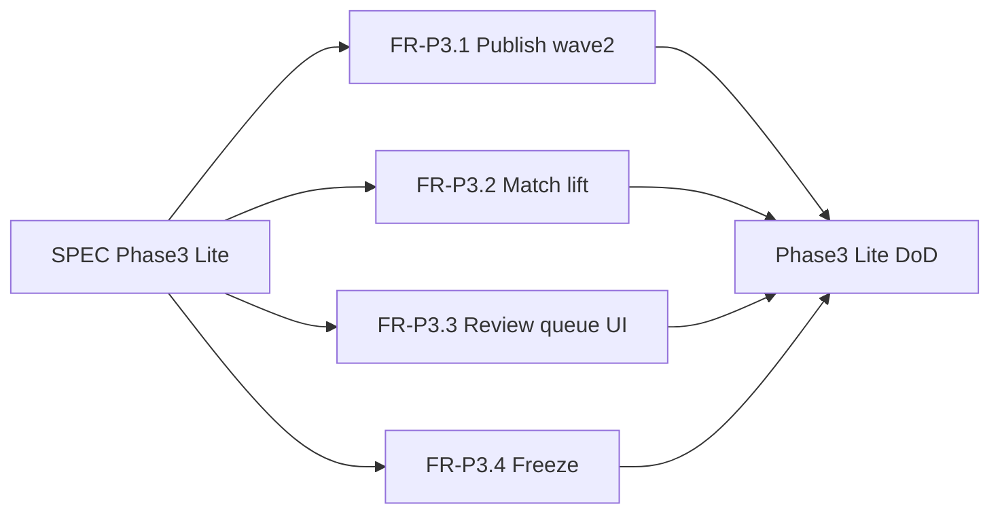
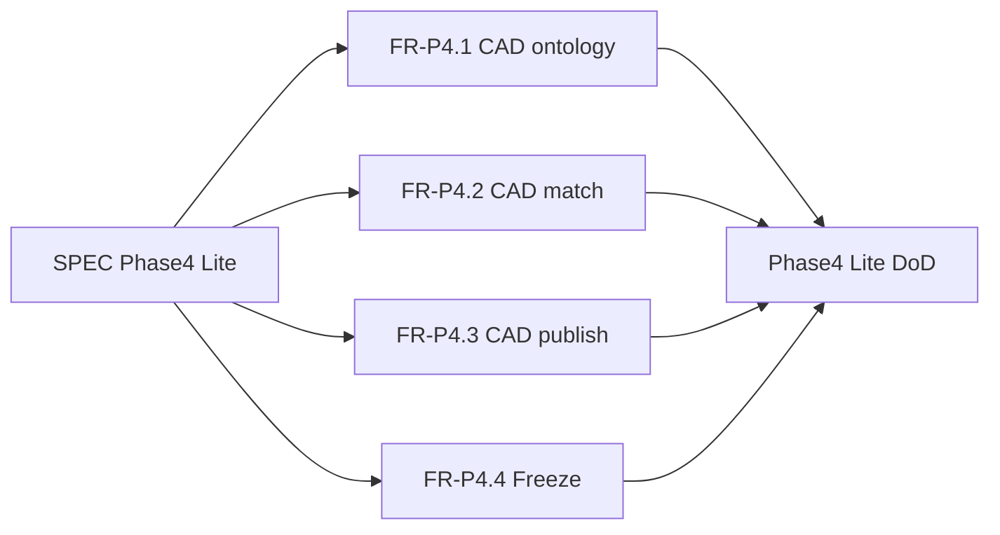

# PSERS Presales Intelligence — Product SPEC

**Status:** Active (Phase 11 Lite — compliance matrix workbook; Pro burn ≤90%)  
**Version:** 0.10.0-spec  
**Last updated:** 2026-07-19  
**Authority:** This file is the source of truth through Phase 11 Lite. Feature slices live under [`specs/`](specs/). Next expansion requires amending this SPEC.

---

## 1. Purpose and users

### Product

**PSERS Presales Intelligence** maps messy customer RFP language to a stable capability ontology, then to Motorola Solutions (MSI) product coverage.

```text
RFP phrases (L2) → Canonical capabilities (L1) → Vendor products (L3)
```

Nothing links RFP text directly to products. Everything routes through L1.

### Primary user

Presales / bid analyst preparing responses for public-safety LMR (Land Mobile Radio) procurements.

### Root model (immutable)

- **Root:** `PSERS` — Public Safety Emergency Response System (of Systems)
- **Facets:** Stack (`INFRA|SENS|PLAT|APP|SVC|XCUT`) + Mission tags  
- **Details:** [docs/psers-root.md](docs/psers-root.md)

---

## 2. As-built baseline (MVP freeze — S0–S4 + Phase 2)

Do not re-litigate MVP or Phase 2 scope. Agents must treat the following as current truth.

| Layer | Current state | Location |
|-------|---------------|----------|
| L1 | **223** `published` + drafts + 0 stubs = 351 | [ontology/l1_capabilities.json](ontology/l1_capabilities.json) |
| L2 | 493 synonyms + 42 holdout; includes `analyst_accepted` from feedback | [ontology/l2_synonyms.json](ontology/l2_synonyms.json), [ontology/l2_synonyms_holdout.json](ontology/l2_synonyms_holdout.json) |
| L3 | 20 MSI products, 285 mappings, 278 caps | [ontology/l3_msi_products.json](ontology/l3_msi_products.json), [ontology/l3_product_capabilities.json](ontology/l3_product_capabilities.json) |
| Match | Deterministic seeds + L2 overlap + name | [ingest/matcher.py](ingest/matcher.py) |
| UI/API | FastAPI + static analyst UI | [app/match_api.py](app/match_api.py), [app/static/](app/static/) |
| Schema | Postgres DDL + optional import CLI; runtime still JSON | [sql/schema.sql](sql/schema.sql), [ingest/load_postgres.py](ingest/load_postgres.py) |
| RFP corpus | 3 allowlisted PDFs (gitignored binaries) | [data/rfp/README.md](data/rfp/README.md) |

### MVP scope locks (still in force unless this SPEC is amended)

- No broad RFP web crawl
- L2 corpus = ECSO Jackson + Erie trunked 2026 + Erie subscriber 2026 only
- L3 = MSI only
- CAD = Phase 4–6; NG911 = Phase 6; Sensors = Phase 5; Incident FIELD/RMS/EOC = Phase 7; MCX = Phase 8 Lite; ALERT = Phase 8 thin; LMR draft thoroughness = Phase 10 Lite

### Explicit non-goals (deferred past Phase 8 Lite)

- Multi-vendor competitive matrix (L3Harris, Tait, etc.)
- EIDO/IDX runtime bus
- Proposal narrative generation / pricing BOM
- Auth, multi-tenant SaaS, SOC2
- Deep MCX beyond Lite (full 3GPP feature tree)
- Military / defence as first-class peer L1 verticals (C2/C3/C4I = L2 crosswalk only)

---

## 3. Phase 2 — Quality hardening (complete)

**Status:** Done — slices [001](specs/001-ontology-governance.md)–[004](specs/004-persistence-lite.md).

Do not re-open Phase 2 FR-1…FR-4 unless a regression is found. See §6 for completed DoD.

---

## 4. Phase 3 Lite — LMR deepen (Cursor-budget aware)

**Goal:** Raise LMR bid-desk trust without expanding verticals. Deterministic only; no LLM; no new RFP PDFs; do not run `generate_l1.py` (it resets publish).



### FR-P3.1 Publish wave 2

| ID | Requirement |
|----|-------------|
| FR-P3.1.1 | Curated priority file `ontology/top50_wave2.json` (≥25 LMR aliases not in top-50) |
| FR-P3.1.2 | `publish_l1.py --priority-file` supports wave2 without changing top-50 default |
| FR-P3.1.3 | After publish: ≥ **75** L1 capabilities `published`; stubs refused; decision-log entry |

**Feature slice:** [specs/010-publish-wave2.md](specs/010-publish-wave2.md)

### FR-P3.2 Match quality lift

| ID | Requirement |
|----|-------------|
| FR-P3.2.1 | Mid-doc Erie pages 21–40 shall-map rate **≥ 0.60** |
| FR-P3.2.2 | Demo fixture map rate **≥ 0.80** (regression) |
| FR-P3.2.3 | Improvements via deterministic seeds / curated L2 only (no `--llm`, no new PDFs) |

**Feature slice:** [specs/011-match-lift.md](specs/011-match-lift.md)

### FR-P3.3 Review queue UI

| ID | Requirement |
|----|-------------|
| FR-P3.3.1 | `GET /api/review-queue` lists staged items |
| FR-P3.3.2 | `POST /api/review-queue/publish` merges pending accept/correct (dry-run supported) |
| FR-P3.3.3 | Analyst UI panel to view queue and publish |

**Feature slice:** [specs/012-review-queue-ui.md](specs/012-review-queue-ui.md)

### FR-P3.4 Freeze

| ID | Requirement |
|----|-------------|
| FR-P3.4.1 | Specs 010–013 Status Done; README sprint row; decision-log freeze |
| FR-P3.4.2 | Explicit stop: next expansion needs SPEC amendment |

**Feature slice:** [specs/013-phase3-freeze.md](specs/013-phase3-freeze.md)

### Cost rules (hard)

- One `specs/01x` slice per agent session when possible
- Prefer Auto/Composer; keep on-demand LLM off
- Stop after slice 012 if usage is tight (013 is optional polish)

---

## 4b. Phase 4 Lite — CAD foundation (Cursor-budget aware)

**Goal:** First vertical expansion — solidify CAD from stubs into a bid-desk-usable draft/published set with deterministic match seeds. Do not regenerate L1; do not expand NG911/Sensors/MCX.



### FR-P4.1 CAD ontology expand

| ID | Requirement |
|----|-------------|
| FR-P4.1.1 | Promote existing CAD stubs → `draft` with `CAD.*` aliases; append to ≥ **25** CAD caps |
| FR-P4.1.2 | Append/promote only — never run `generate_l1.py`; LMR published ≥ 75 preserved |
| FR-P4.1.3 | Keep non-CAD stubs so stub count remains ≥ 20 |

**Feature slice:** [specs/020-cad-ontology.md](specs/020-cad-ontology.md)

### FR-P4.2 CAD match + demo eval

| ID | Requirement |
|----|-------------|
| FR-P4.2.1 | Deterministic CAD seeds; `demo_cad_requirements.txt` |
| FR-P4.2.2 | `cad_demo` eval suite map rate ≥ **0.80** |
| FR-P4.2.3 | LMR demo ≥ 0.80 and mid-doc ≥ 0.60 still pass |

**Feature slice:** [specs/021-cad-match.md](specs/021-cad-match.md)

### FR-P4.3 CAD publish top-N

| ID | Requirement |
|----|-------------|
| FR-P4.3.1 | `ontology/top15_cad.json` priority file |
| FR-P4.3.2 | ≥ **15** CAD capabilities `published` via `publish_l1.py --priority-file` |

**Feature slice:** [specs/022-cad-publish.md](specs/022-cad-publish.md)

### FR-P4.4 Freeze

| ID | Requirement |
|----|-------------|
| FR-P4.4.1 | Specs 020–023 Done; README; decision-log; stop note for NG911/Sensors/MCX |

**Feature slice:** [specs/023-phase4-freeze.md](specs/023-phase4-freeze.md)

---

## 5. Top-50 bid-desk capabilities (publish priority — Phase 2)

Aliases below map to full `PSERS.INFRA.*` IDs via L1 `alias` field. Wave 2 lives in [ontology/top50_wave2.json](ontology/top50_wave2.json).

1. `LMR.STD.P25_PHASE1`
2. `LMR.STD.P25_PHASE2`
3. `LMR.STD.DUAL_MODE_FDMA_TDMA`
4. `LMR.STD.TRUNKED_OPS`
5. `LMR.STD.CONVENTIONAL_OPS`
6. `LMR.STD.P25_CAP`
7. `LMR.CORE.GEO_REDUNDANT_CORE`
8. `LMR.CORE.NO_SPOF`
9. `LMR.CORE.CENTRALIZED_CORE`
10. `LMR.CORE.DISTRIBUTED_CORE`
11. `LMR.CORE.FAILSOFT`
12. `LMR.CORE.SITE_TRUNKING`
13. `LMR.CORE.TRANSPARENT_ROAMING`
14. `LMR.CORE.DYNAMIC_REGROUP`
15. `LMR.SITE.SIMULCAST_TRUNKED`
16. `LMR.SITE.BASE_REPEATER`
17. `LMR.SITE.COMPARATOR`
18. `LMR.SITE.VOTING_RECEIVER`
19. `LMR.SITE.SIMULCAST_TIMING`
20. `LMR.SITE.TTA`
21. `LMR.COV.DAQ_3_4`
22. `LMR.COV.COV_95_AREA`
23. `LMR.COV.GOS_1PCT`
24. `LMR.COV.PORTABLE_IN_BUILDING`
25. `LMR.COV.PORTABLE_ON_STREET`
26. `LMR.COV.COVERAGE_TESTING`
27. `LMR.COV.COVERAGE_GUARANTEE`
28. `LMR.VOICE.GROUP_CALL`
29. `LMR.VOICE.PRIVATE_CALL`
30. `LMR.VOICE.EMERGENCY_ALARM`
31. `LMR.VOICE.EMERGENCY_CALL`
32. `LMR.VOICE.PTT_ID`
33. `LMR.DATA.GPS_AVL`
34. `LMR.DATA.OTAP`
35. `LMR.DATA.TEXT_MESSAGING`
36. `LMR.SEC.AES256`
37. `LMR.SEC.OTAR`
38. `LMR.SEC.KMF`
39. `LMR.SEC.KVL`
40. `LMR.IOP.ISSI`
41. `LMR.IOP.CSSI`
42. `LMR.IOP.MUTUAL_AID_PATCH`
43. `LMR.DISP.CONSOLE_POSITIONS`
44. `LMR.DISP.LOGGING_RECORDER`
45. `LMR.NMS.UNIFIED_NMS`
46. `LMR.BH.MICROWAVE_BH`
47. `LMR.BH.IP_TRANSPORT`
48. `LMR.SUB.MULTIBAND_PORTABLE`
49. `LMR.SUB.PORTABLE_GENERAL`
50. `LMR.BB.LTE_PTT_BRIDGE`

---

## 6. Non-functional requirements

| ID | Requirement |
|----|-------------|
| NFR-1 | Cursor Pro–friendly: default deterministic pipelines; no on-demand LLM spend assumed |
| NFR-2 | Allowlisted RFP corpus unchanged unless SPEC amended |
| NFR-3 | No secrets in git; `data/rfp/*.pdf` and feedback runtime files stay gitignored as configured |
| NFR-4 | Validators `validate_l1.py` / `validate_l2.py` / `validate_l3.py` must remain green |
| NFR-5 | Prefer small PRs / slices aligned to `specs/00x-*.md` / `specs/01x-*.md` |

---

## 7. Phase-2 Definition of Done (complete)

- [x] `py -3.12 ontology/validate_l1.py` → OK  
- [x] `py -3.12 ontology/validate_l2.py` → OK  
- [x] `py -3.12 ontology/validate_l3.py` → OK  
- [x] ≥ **50** L1 capabilities from the top-50 list marked `published`  
- [x] Eval harness exists and reports demo map-rate ≥ 80% and mid-doc map-rate ≥ 50% (or documents gap with issue filed in decision-log)  
- [x] Feedback `accept`/`correct` updates staged L2 review queue; publish path merges into L2 with test  
- [x] Postgres import CLI works against local DB when `DATABASE_URL` set  
- [x] Each completed slice flips **Status → Done** in its `specs/00x-*.md`  
- [x] README points here as next-work authority  

---

## 8. Phase 3 Lite Definition of Done

- [x] ≥ **75** L1 capabilities `published` (wave2 ≥25 new)
- [x] Mid-doc map rate ≥ **0.60**; demo ≥ **0.80**
- [x] Review queue visible + publishable from UI
- [x] Validators green
- [x] Specs 010–013 Status Done; README sprint row; decision-log freeze
- [x] Deferred themes (CAD / multi-vendor / crawl / proposal) still deferred

---

## 8b. Phase 4 Lite Definition of Done

- [x] ≥ **25** CAD-vertical capabilities at `draft` or `published`
- [x] ≥ **15** CAD capabilities `published`
- [x] `cad_demo` map rate ≥ **0.80**; LMR demo ≥ 0.80; LMR mid-doc ≥ 0.60
- [x] LMR published count still ≥ **75**
- [x] Validators green; specs 020–023 Done; README + decision-log freeze
- [x] NG911 / Sensors / MCX / multi-vendor / crawl still deferred

---

## 8c. Phase 5 Lite — Sensors foundation (Cursor-budget aware)

**Goal:** First Sensors vertical expand (VIDEO/IOT/UAS + VMS) with deterministic match seeds. Do not expand MCX. Do not regenerate L1.

### FR-P5.1 Sensors ontology

| ID | Requirement |
|----|-------------|
| FR-P5.1.1 | Promote VIDEO/IOT/UAS (+ VMS) stubs → draft with aliases; append to ≥ **18** sensor caps |
| FR-P5.1.2 | `validate_l1.py` stub floor ≥ **10** |
| FR-P5.1.3 | Never run `generate_l1.py` |

**Feature slice:** [specs/030-sensors-ontology.md](specs/030-sensors-ontology.md)

### FR-P5.2 Sensors match

| ID | Requirement |
|----|-------------|
| FR-P5.2.1 | Deterministic sensor seeds; `sensors_demo` ≥ **0.80** |
| FR-P5.2.2 | LMR/CAD/NG911 demos and LMR mid-doc still pass |

**Feature slice:** [specs/031-sensors-match.md](specs/031-sensors-match.md)

### FR-P5.3 Sensors publish

| ID | Requirement |
|----|-------------|
| FR-P5.3.1 | ≥ **15** sensor capabilities published |
| FR-P5.3.2 | Light MSI L3 maps; decision-log stop (MCX deferred) |

**Feature slice:** [specs/032-sensors-publish.md](specs/032-sensors-publish.md)

### Phase 5 Lite Definition of Done

- [x] ≥ 18 sensor-related caps; ≥ 15 published
- [x] `sensors_demo` ≥ 0.80; existing suites pass
- [x] Validators green (stubs ≥ 10)
- [x] Specs 030–032 Done; MCX still deferred

---

## 8d. Phase 6 Lite — CAD + NG911 deepen (Cursor-budget aware)

**Goal:** Deepen the PSAP loop (NG911 call take → CAD handoff → unit status). Do not re-open Sensors. Do not expand MCX. Do not regenerate L1.

### FR-P6.1 CAD + NG911 ontology wave

| ID | Requirement |
|----|-------------|
| FR-P6.1.1 | Append CAD drafts to ≥ **55** CAD-related caps via `expand_cad_l1.py` |
| FR-P6.1.2 | Append NG911 drafts to ≥ **35** NG911 caps via `expand_ng911_l1.py` |
| FR-P6.1.3 | Never run `generate_l1.py`; Sensors/MCX unchanged |

**Feature slice:** [specs/040-cad-ng911-ontology.md](specs/040-cad-ng911-ontology.md)

### FR-P6.2 Match + PSAP loop eval

| ID | Requirement |
|----|-------------|
| FR-P6.2.1 | Deterministic seeds for new aliases; expand CAD/NG911 demos |
| FR-P6.2.2 | `psap_loop` suite ≥ **0.80**; existing LMR/CAD/NG911/sensors suites pass |

**Feature slice:** [specs/041-cad-ng911-match.md](specs/041-cad-ng911-match.md)

### FR-P6.3 Publish + L3 + stop

| ID | Requirement |
|----|-------------|
| FR-P6.3.1 | CAD published ≥ **45**; NG911 published ≥ **28** |
| FR-P6.3.2 | CommandCentral L3 maps for newly published IDs; decision-log stop (MCX deferred) |

**Feature slice:** [specs/042-cad-ng911-publish.md](specs/042-cad-ng911-publish.md)

### Phase 6 Lite Definition of Done

- [x] CAD ≥ 55 caps; CAD published ≥ 45 (**56** / **56**)
- [x] NG911 ≥ 35 caps; NG911 published ≥ 28 (**35** / **35**)
- [x] `cad_demo`, `ng911_demo`, `psap_loop` ≥ 0.80; LMR + sensors suites pass
- [x] Validators green; specs 040–042 Done; MCX still deferred

---

## 8e. Phase 7 Lite — Incident management process (Cursor-budget aware)

**Goal:** Close the respond → after_action gap (FIELD apps, RMS, thin EOC) so incident management is matchable end-to-end. Map C2/C3/C4I as L2 terminology only. Do not add military peer L1 trees. Do not deepen MCX. Do not regenerate L1.

### FR-P7.1 FIELD / RMS / EOC ontology

| ID | Requirement |
|----|-------------|
| FR-P7.1.1 | Promote MDT / RMS incident report / EOC sit-awareness stubs; append FIELD+RMS+EOC drafts |
| FR-P7.1.2 | FIELD-related ≥ **8**; RMS-related ≥ **5**; EOC ≥ **1** |
| FR-P7.1.3 | Never run `generate_l1.py`; no Sensors catalog re-expand; MCX remains stub |

**Feature slice:** [specs/050-incident-ontology.md](specs/050-incident-ontology.md)

### FR-P7.2 Match + C2/C4I crosswalk

| ID | Requirement |
|----|-------------|
| FR-P7.2.1 | Deterministic seeds for new aliases + C2/C3/C4I synonyms; `incident_mgmt` ≥ **0.80** |
| FR-P7.2.2 | Existing LMR/CAD/NG911/sensors/`psap_loop` suites still pass |
| FR-P7.2.3 | `docs/c2-c4i-crosswalk.md` term → L1 table |

**Feature slice:** [specs/051-incident-match.md](specs/051-incident-match.md)

### FR-P7.3 Publish + L3 + stop

| ID | Requirement |
|----|-------------|
| FR-P7.3.1 | FIELD published ≥ **6**; RMS published ≥ **4**; EOC published ≥ **1** |
| FR-P7.3.2 | Light MSI L3 maps; decision-log stop (military peer trees / MCX deferred) |

**Feature slice:** [specs/052-incident-publish.md](specs/052-incident-publish.md)

### Phase 7 Lite Definition of Done

- [x] FIELD ≥ 8 caps; FIELD published ≥ 6 (**11** / **8**)
- [x] RMS ≥ 5 caps; RMS published ≥ 4 (**5** / **5**)
- [x] EOC ≥ 1 published (**2**); `incident_mgmt` ≥ 0.80; prior suites pass
- [x] Validators green; specs 050–052 Done; military/MCX still deferred

---

## 8f. Slice 060 — Stakeholder visualization (presentation pack)

**Goal:** Explain PSERS to business and technical stakeholders without a 300-node graph. Docs + thin UI only; no ontology regenerate.

| ID | Requirement |
|----|-------------|
| FR-060.1 | Stakeholder guide with mission swimlane, L2→L1→L3 bridge, stack/status legend, 10-min demo script |
| FR-060.2 | Explainer section in analyst UI + `GET /api/ontology/summary` counts |
| FR-060.3 | C2/C4I remains crosswalk-only; no military peer L1; no graph DB |

**Feature slice:** [specs/060-stakeholder-viz.md](specs/060-stakeholder-viz.md)  
**Guide:** [docs/ontology-stakeholder-guide.md](docs/ontology-stakeholder-guide.md)

### Slice 060 Definition of Done

- [x] Guide + UI explainer + summary API shipped
- [x] Live match still primary demo path; MCX / military deferred

---

## 8g. Phase 8 Lite — MCX + coverage export (Cursor Pro ≤90%)

**Goal:** Highest remaining bid-desk value under a Pro usage cap: (1) coverage CSV/JSON export, (2) MCX Lite, (3) thin ALERT. No military peer L1; no L1 regenerate.

| ID | Requirement |
|----|-------------|
| FR-P8.1 | Promote/append MCX ≥ **12** caps; `mcx_demo` ≥ **0.80** |
| FR-P8.2 | Bid-desk coverage export (UI download + `POST /api/match/export`) |
| FR-P8.3 | Thin ALERT publish; stub floor ≥ **3**; freeze |

### Phase 8 Lite Definition of Done

- [x] MCX Lite published (wave1); `mcx_demo` ≥ 0.80
- [x] Coverage CSV/JSON download in analyst UI
- [x] ALERT thin published; validators green; military still deferred

---

## 8h. Phase 9 — High-value pack (Pro burn, ≤90%)

**Goal:** Spend remaining Pro budget on bid-desk ROI: mid-doc lift, L3 completeness, GIS/IAM, full-stack demo, maturity UI, gap report CLI.

| ID | Requirement |
|----|-------------|
| FR-P9.1 | Mid-doc map rate ≥ **0.70** (boilerplate filter + site RF seeds) |
| FR-P9.2 | Fill MSI maps for published caps; GIS/IAM/WEA publish |
| FR-P9.3 | `fullstack_demo` ≥ 0.80; gap report CLI; maturity table in UI |

**Details:** [docs/sprint-p9-done.md](docs/sprint-p9-done.md)

### Phase 9 Definition of Done

- [x] Mid-doc ≥ 0.70; L3 gap-fill; GIS published; fullstack demo green
- [x] Military / multi-vendor still deferred

---

## 8i. Phase 10 Lite — L1-first thoroughness (Pro ≤90%)

**Goal:** Make **L1** robust before further L3 polish. Prioritize LMR draft→publish, residual VIDEO/IOT/FIELD drafts, L1 quality audit, and L2 seeds so new L1 is matchable. Thin L3 gap-fill only for newly published IDs. No `generate_l1.py`; no military peer L1; no L3 citation campaign.

| ID | Requirement |
|----|-------------|
| FR-P10.1 | Promote **≥80** high-RFP LMR drafts (VOICE→SUB→DISP→LIFE→NMS→SEC→IOP→DATA→BH…) |
| FR-P10.2 | L1 quality / coverage audit CLI; alias + mission + description checks on promoted set |
| FR-P10.3 | Publish residual VIDEO/IOT/FIELD drafts (**≥8**) |
| FR-P10.4 | Mid-doc / L2 seeds so robust L1 is matchable (target mid_doc ≥ **0.78** when PDFs present) |
| FR-P10.5 | Thin L3 fill for newly published L1 only; freeze |

**Details:** [specs/090-phase10-l1-thorough.md](specs/090-phase10-l1-thorough.md)

### Phase 10 Lite Definition of Done

- [x] ≥80 LMR drafts published; residual VIDEO/IOT/FIELD largely published
- [x] `ontology/l1_coverage_audit.py` exists and promoted set is clean
- [x] Thin L3 gap-fill for new published IDs; prior eval suites green
- [x] Decision-log freeze; military / multi-vendor still deferred

---

## 8j. Phase 11 Lite — Compliance matrix workbook (Pro budget aware)

**Goal:** Turn match results into a bid-desk compliance workbook (one row per requirement) that analysts import into Google Sheets. Reuse deterministic match; no LLM; no Google Sheets API; no proposal narrative.

| ID | Requirement |
|----|-------------|
| FR-P11.1 | `ingest/compliance_matrix.py` builds Compliance / Summary / Gaps `.xlsx` rows with suggested C/A (never auto-N) + stakeholder columns |
| FR-P11.2 | CLI `ingest/export_compliance.py` for PDF/text → `.xlsx` |
| FR-P11.3 | `POST /api/compliance/matrix` + UI **Download compliance workbook**; `export?format=xlsx` on text path |
| FR-P11.4 | Playbook + decision-log; freeze |

**Feature slice:** [specs/100-compliance-matrix.md](specs/100-compliance-matrix.md)

### Phase 11 Lite Definition of Done

- [x] Demo fixture → workbook with one row per requirement
- [x] Suggested C/A only with MSI evidence; blanks for gaps
- [x] Import path = `.xlsx` → Google Sheets (no Sheets API)
- [x] Narrative / pricing / multi-vendor still out of scope

---

## 9. Cursor agent protocol

1. Read this `SPEC.md` and the relevant slice. Prefer Auto/Composer; keep Pro usage **under 90%**.  
2. Implement only the requested slice; never run `generate_l1.py`.  
3. Do not open military peer L1 / multi-vendor without SPEC amendment.
4. Phase 11 priority: **compliance workbook export**; do not reopen L1 thoroughness unless regression.

---

## 10. Appendix — still out of scope

- Military / defence peer L1 verticals  
- Multi-vendor L3  
- Full interactive ontology graph explorer  
- Broader RFP corpus / crawl  
- Proposal generation, pricing, SSO  
- L3 datasheet citation polish as a primary goal (deferred past Phase 10)
- Google Sheets live API sync (workbook import is enough for Phase 11)

When ready, amend this SPEC beyond Phase 11.
