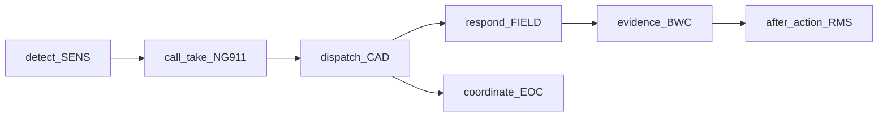
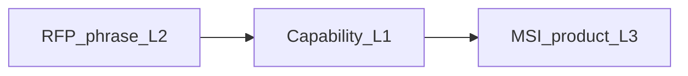

# PSERS ontology — stakeholder guide

**Audience:** business, bid desk, and technical stakeholders  
**Slice:** 060 (visualization / explainer)  
**Rule:** Lead with process, then matching bridge, then model catalog. Do **not** open with a 300+ node graph.

**One sentence:** We map buyer RFP language to stable **capabilities (L1)**, then to **Motorola Solutions products (L3)**—never RFP text straight to SKUs.

---

## 1. Business view — incident journey

Public-safety incident management as a mission swimlane (systems are examples, not products):

| Stage | Mission tag | Example systems in PSERS |
|-------|-------------|--------------------------|
| Sense / detect | `detect` | Video, ALPR, gunshot, UAS |
| Call take | `call_take` | NG911 / i3 PSAP |
| Dispatch | `dispatch` | CAD |
| Field respond | `respond` | Mobile CAD, MDT, field capture apps |
| Evidence | `respond` / `after_action` | Body-worn camera + field evidence |
| Records close-out | `after_action` | RMS case / incident report |
| Command view | `coordinate` | CAD command view, EOC sit-awareness |

**C2 / C3 / C4I:** industry terminology mapped onto these same capabilities—see [c2-c4i-crosswalk.md](c2-c4i-crosswalk.md). Not a separate military ontology in this product.

---

## 2. Bid-desk bridge — L2 → L1 → L3

**Worked example**

| Layer | Example |
|-------|---------|
| L2 (buyer language) | “Field apps shall capture photos into the evidence workflow” |
| L1 (stable capability) | `FIELD.EVIDENCE_CAPTURE` → `PSERS.APP.FIELD.EVIDENCE_CAPTURE` |
| L3 (MSI coverage) | CommandCentral suite mapping (native / option) |

Live demo: paste fixtures from `ontology/samples/demo_incident_mgmt.txt` in the analyst UI (`http://127.0.0.1:8000/`).

---

## 3. Technical view — model catalog

**ID scheme:** `PSERS.<STACK>.<DOMAIN>.<CAPABILITY>`  
**Stacks:** `INFRA` | `SENS` | `PLAT` | `APP` | `SVC` | `XCUT`  
**Missions:** `detect` | `call_take` | `locate` | `dispatch` | `respond` | `coordinate` | `inform` | `after_action`

| Stack | Role | Domains (examples) |
|-------|------|--------------------|
| INFRA | Mission-critical comms / sites | LMR, MCX (stub), backhaul |
| SENS | Sensors & media capture | VIDEO, IOT, UAS |
| PLAT | Platforms | NG911, CAD, RMS, VMS, GIS |
| APP | End-user applications | FIELD, EOC, ALERT |
| SVC | Services | Integration, training |
| XCUT | Cross-cutting | Interop, encryption |

**Status legend**

| Status | Meaning for stakeholders |
|--------|--------------------------|
| `published` | Bid-desk safe; used in matching / publish batches |
| `draft` | Expanded, not yet in a publish priority file |
| `stub` | Placeholder ID only (e.g. deep MCX) |

**Where truth lives**

| Artifact | Path |
|----------|------|
| L1 catalog | [ontology/l1_capabilities.json](../ontology/l1_capabilities.json) |
| Product authority | [SPEC.md](../SPEC.md) |
| Root & facets | [psers-root.md](psers-root.md) |
| C2/C4I terms | [c2-c4i-crosswalk.md](c2-c4i-crosswalk.md) |
| Match eval | `py -3.12 ontology/eval_match.py` |
| Analyst UI | `py -3.12 -m uvicorn app.match_api:app --host 127.0.0.1 --port 8000` |

Live counts: `GET /api/ontology/summary` on the running API.

---

## 4. Ten-minute demo script

1. **(2 min) Business** — Show the swimlane above. Say the one sentence.
2. **(5 min) Bridge** — Open UI → Paste tab → load / paste 3 lines from `demo_incident_mgmt.txt` → Run match → point at L1 alias + MSI coverage.
3. **(2 min) C2 callout** — Paste “Command and control supervisory views shall show active incidents” → maps via crosswalk seeds (not a new vertical).
4. **(1 min) Technical** — Open Explainer panel / this guide → stack table + `published` vs `stub` → “MCX and military peer trees deferred.”

---

## 5. What not to do in the first meeting

- Dump the full L1 JSON or a force-directed graph of every capability
- Debate runtime EIDO/IDX buses (operational CDM — later)
- Promise multi-vendor L3 or military peer L1 without a SPEC amendment
